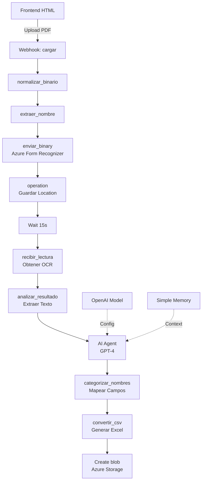

# 📄 Flujo de Automatización OCR para Documentos Judiciales

## 🎯 Descripción General

Este flujo de n8n implementa un sistema completo de **extracción automatizada de datos** desde documentos judiciales en formato PDF utilizando OCR (Reconocimiento Óptico de Caracteres) y procesamiento con Inteligencia Artificial. El sistema convierte automáticamente documentos escaneados en datos estructurados exportables a Excel.

### Características Principales
- 🔍 **OCR Avanzado**: Utiliza Azure Form Recognizer para extraer texto de PDFs escaneados
- 🤖 **IA Inteligente**: Emplea GPT-4 para análisis y categorización semántica del contenido
- 📊 **Salida Estructurada**: Genera automáticamente archivos Excel con 14 campos específicos
- ☁️ **Almacenamiento en la Nube**: Guarda los resultados en Azure Blob Storage
- 🌐 **Interfaz Web**: Frontend HTML responsivo para carga fácil de documentos

## 🏗️ Arquitectura del Flujo



ir al codigo del flujo [aqui](https://github.com/Ferx096/poc_ocr/blob/main/n8n_json/ocr_final.json)

ir a la version donde se descargue el aquivo excel [aqui](https://github.com/Ferx096/poc_ocr/blob/main/n8n_json/ocr_web-3.json)

## 📦 Componentes del Sistema

### 1. **Frontend (index.html)**
- **Función**: Interfaz de usuario para carga de PDFs
- **Tecnología**: HTML5, CSS3, JavaScript vanilla
- **Características**:
  - Drag & drop para archivos
  - Validación de tipo de archivo (solo PDFs)
  - Indicadores de progreso
  - Mensajes de estado en tiempo real
  - Modo debug con logs detallados


  

[Ir a web](https://ferx096.github.io/poc_ocr/),  [Ir al codigo html para despliegue](https://github.com/Ferx096/poc_ocr/blob/main/index.html)


### 2. **Webhook de Entrada (`cargar`)**
- **Tipo**: `n8n-nodes-base.webhook`
- **Endpoint**: `/ocr-upload`
- **Método**: POST
- **Función**: Recibe el archivo PDF desde el frontend

### 3. **Procesamiento del Archivo**

#### `normalizar_binario`
```javascript
// Normaliza el archivo binario para procesamiento
const items = [];
for (const item of $input.all()) {
  const newItem = {
    json: { ...item.json, hasAttachment: true },
    binary: {}
  };
  if (item.binary?.attachment_0) {
    newItem.binary.attachment_0 = item.binary.attachment_0;
  }
  items.push(newItem);
}
```

#### `extraer_nombre`
- Extrae el nombre del archivo sin extensión
- Prepara el binario para envío a Azure

### 4. **OCR con Azure Form Recognizer**

#### `enviar_binary`
- **Servicio**: Azure Cognitive Services
- **Endpoint**: `https://primapoc.cognitiveservices.azure.com/formrecognizer/v2.1/layout/analyze`
- **Función**: Inicia el proceso de OCR asíncrono

#### `operation` + `Wait`
- Guarda la URL de operación devuelta por Azure
- Espera 15 segundos para que el OCR se complete

#### `recibir_lectura`
- Consulta el estado del OCR
- Obtiene los resultados del análisis

### 5. **Procesamiento con IA**

#### `AI Agent`
- **Modelo**: GPT-4.1-2025-04-14
- **Prompt del Sistema**:
```
Analiza este documento judicial y extrae estos 14 campos en formato tabla:
- NumExpediente (código del proceso)
- NumDocumento (número de oficio/resolución)
- FechaEmision (fecha de emisión)
- FechaRecepcion (fecha de notificación)
- Materia (tipo de proceso)
- Demandado (formato: APELLIDOS, NOMBRES)
- Demandante (solo nombre)
- Alimentista (beneficiario, si existe)
- Pretension (lo solicitado)
- TipoRetencion (porcentaje o monto)
- TopeOFechaFin (límite, o "No consta")
- PlazoRespuesta (plazo, o "No consta")
- NombreJuzgado (juzgado emisor)
- Juez (magistrado firmante)
```

### 6. **Generación de Excel**

#### `categorizar_nombres`
- **Mapeo de Campos**: Convierte la salida del AI Agent a estructura Excel
- **Campos del Excel**:
  1. Nombre del PDF
  2. N.º de expediente
  3. N.º de documento
  4. Fecha de emisión del documento
  5. Fecha de recepción del documento
  6. Materia
  7. Demandado
  8. Demandante (solo nombre)
  9. Alimentista
  10. Pretensión
  11. Tipo de retención (porcentaje o monto)
  12. ¿La retención tiene tope o fecha de finalización?
  13. Plazo para responder el oficio
  14. Nombre del Juzgado
  15. Juez

#### `convertir_csv`
- Convierte el JSON estructurado en formato CSV/Excel
- Agrega el archivo como binario al flujo

### 7. **Almacenamiento**

#### `Create blob`
- **Servicio**: Azure Blob Storage
- **Container**: `documents`
- **Función**: Almacena el Excel resultante en la nube

## 🔧 Configuración Requerida

### Credenciales Necesarias

1. **OpenAI API**
   - ID: `wC5k9nfhP8vKa1sp`
   - Nombre: `openai_poc10`
   - Modelo: GPT-4.1-2025-04-14

2. **Azure Form Recognizer**
   - ID: `nc4dTlu0h1pj1rZN`
   - Nombre: `document_intelligence`
   - Endpoint: `primapoc.cognitiveservices.azure.com`

3. **Azure Blob Storage**
   - ID: `q2kONl2cwdkAeB2w`
   - Nombre: `ocr_blob`
   - Container: `documents`

### Variables de Entorno

```bash
# Webhook URL
WEBHOOK_URL=https://inadvance.app.n8n.cloud/webhook/ocr-upload

# Azure Form Recognizer - ocr azure document intelligence
AZURE_FORM_RECOGNIZER_ENDPOINT=https://primapoc.cognitiveservices.azure.com
AZURE_FORM_RECOGNIZER_KEY=<tu-api-key>
**en caso se necesite direccion ip para azure document intelligence** [ejecutar este codigo](https://github.com/Ferx096/poc_ocr/blob/main/n8n_json/ip.json)

# OpenAI
OPENAI_API_KEY=<tu-api-key>

# Azure Storage
AZURE_STORAGE_ACCOUNT=<tu-cuenta>
AZURE_STORAGE_KEY=<tu-key>
```

## 📊 Flujo de Datos

1. **Entrada**: PDF de documento judicial (escaneado o digital)
2. **OCR**: Extracción de texto crudo del documento
3. **Análisis IA**: Identificación y extracción de campos específicos
4. **Estructuración**: Mapeo de datos a formato tabular
5. **Salida**: Archivo Excel con todos los campos extraídos

## 🚀 Instalación y Despliegue

### Paso 1: Importar el Flujo en n8n
```bash
1. Accede a tu instancia de n8n
2. Ve a "Workflows" > "Import from File"
3. Selecciona el archivo ocr_final.json
4. Configura las credenciales requeridas
```

### Paso 2: Configurar el Frontend
```javascript
// En index.html, actualizar la línea 484:
const WEBHOOK_URL = 'https://tu-dominio.app.n8n.cloud/webhook/ocr-upload';
```

### Paso 3: Activar el Flujo
```bash
1. Verifica todas las conexiones de nodos
2. Activa el workflow desde el switch superior
3. El webhook estará disponible inmediatamente
```


---

## 📋 Anexo: Estructura JSON del Flujo

El flujo contiene **13 nodos** principales con las siguientes conexiones:

```json
{
  "name": "ocr_final",
  "nodes": [/* 13 nodos */],
  "connections": {
    "cargar -> normalizar_binario -> extraer_nombre",
    "extraer_nombre -> enviar_binary -> operation",
    "operation -> Wait -> recibir_lectura",
    "recibir_lectura -> analizar_resultado -> AI Agent",
    "AI Agent -> categorizar_nombres -> convertir_csv",
    "convertir_csv -> Create blob"
  },
  "active": true,
  "versionId": "abcfb459-0b06-494a-8953-91e91da2fc15"
}
```


## 📝 Licencia

Este proyecto está licenciado bajo MIT License - ver el archivo [LICENSE](LICENSE) para más detalles.

## 👥 **Autor**

**Fernando Cabrera** - AI Engineer [linkedin](https://www.linkedin.com/in/fernando-cabrera-barranzuela)

---

⭐ Si este proyecto te ha sido útil, considera darle una estrella en GitHub!

---